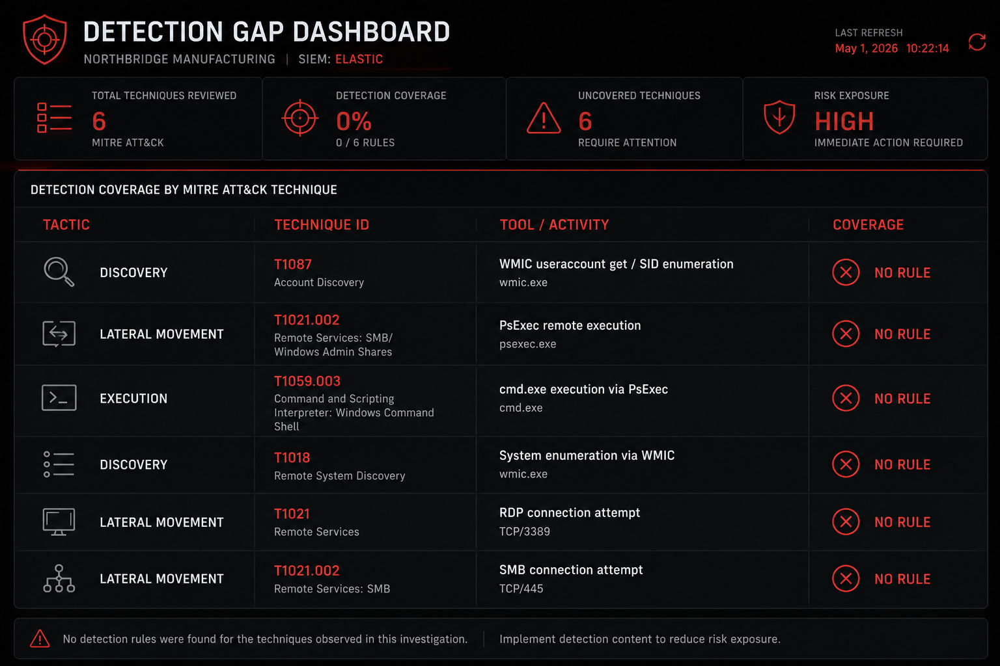

# Detection Opportunities
### INC-2026-03-01 | NorthBridge Manufacturing

---

## Purpose

This document analyzes the detection gaps exposed by INC-2026-03-01 and proposes specific detection rules that would have identified this activity earlier — or automatically, without analyst intervention.

The incident was detected through **manual analyst review** of a low-severity SIEM alert. No automated rule fired on the core attack behavior. Every technique used was a signed Microsoft binary operating within normal Windows functionality. This represents a structural gap in behavioral detection coverage, not a tool failure.

---

## Detection Gap Analysis

### Gap 1 — No Rule for PsExec Execution by Non-Administrative Users

**What happened:** `psexec.exe` was executed by `m.perez`, a plant engineering account, against an internal server. No alert fired.

**Why it was missed:** PsExec is a legitimate administrative tool. If no rule exists to baseline *who* is authorized to run it and from *which* hosts, its execution is invisible to the SIEM.

**Impact:** The highest-confidence malicious event in the entire chain — a non-admin user running a remote execution tool with alternate credentials — produced no automated alert.

---

### Gap 2 — No Rule for Plaintext Credentials in Command-Line Arguments

**What happened:** The `admin` account password was passed as a `-p` argument in the PsExec command line, fully captured in Sysmon Event ID 1. No alert fired.

**Why it was missed:** Command-line argument pattern matching for credential flags (`-p`, `/p`, `-password`) was not implemented.

**Impact:** A confirmed credential compromise was recorded in the SIEM and not actioned until manual review.

---

### Gap 3 — No Behavioral Baseline for WMIC Account Enumeration

**What happened:** `wmic useraccount get name,sid` executed on a plant engineering workstation. No alert fired.

**Why it was missed:** WMIC is a native Windows tool used legitimately by IT administrators. Without a behavioral baseline distinguishing authorized WMIC usage from reconnaissance, the command is treated as normal system activity.

**Impact:** The Discovery phase of the attack — the clearest indicator of attacker intent following the failed PsExec — produced no automated detection.

---

### Gap 4 — Outbound RDP from Non-IT Assets Not Flagged

**What happened:** `WKSTN-MKT-04` — a plant engineering workstation — initiated an outbound RDP connection to an internal host. The firewall permitted it. No alert fired.

**Why it was missed:** No rule existed to alert on outbound RDP from workstations outside the IT/admin asset group.

**Impact:** The lateral movement attempt reached the network layer and was permitted without triggering any detection.

---

### Gap 5 — Combined RDP + SMB Pattern Not Correlated

**What happened:** RDP (3389) and SMB (445) connections were made to the same destination within 4 seconds. No correlation rule fired.

**Why it was missed:** Individual firewall events were not being correlated across protocols and time windows to identify scanning or multi-vector lateral movement patterns.

**Impact:** A behavioral signature strongly indicative of automated or scripted lateral movement tooling went undetected.

---

## Proposed Detection Rules

---

### Rule 1 — PsExec Execution by Unauthorized User

**Tactic:** Lateral Movement / Execution
**Technique:** T1021.002, T1569.002
**Severity:** HIGH
**Source:** Sysmon Event ID 1

**Logic:**
```kql
event.code: "1"
AND process.name: "psexec.exe"
AND NOT user.name: ("svcadmin" OR "Administrator" OR "IT-*")
```

**Tuning notes:**
- Maintain an allowlist of authorized accounts and hosts permitted to run PsExec
- Alert should fire regardless of target host — the user context is the primary anomaly
- Suppress only after confirming legitimate administrative use cases

**Expected false positive rate:** Low — PsExec has no legitimate use case for plant engineering, marketing, or finance user accounts

---

### Rule 2 — Plaintext Credential Pattern in Process Command Line

**Tactic:** Credential Access
**Technique:** T1552.001
**Severity:** CRITICAL
**Source:** Sysmon Event ID 1 / Event ID 4688

**Logic:**
```kql
event.code: "1"
AND process.command_line: (* -p * OR * /p * OR * -password * OR * --password *)
AND NOT (process.name: ("msiexec.exe" OR "setup.exe") AND user.name: ("svcadmin"))
```

**Tuning notes:**
- Exclude known legitimate installer processes with approved service accounts
- Any match outside the exclusion list should be treated as HIGH confidence
- The credential value itself should be immediately redacted in documentation and rotated

**Expected false positive rate:** Low to medium — requires tuning against known legitimate deployment scripts

---

### Rule 3 — WMIC Account Enumeration from Non-Administrative Host

**Tactic:** Discovery
**Technique:** T1087.001
**Severity:** MEDIUM
**Source:** Sysmon Event ID 1

**Logic:**
```kql
event.code: "1"
AND process.name: "wmic.exe"
AND process.command_line: (*useraccount* OR *localgroup* OR *group* OR *sid*)
AND NOT host.name: ("ADMIN-*" OR "IT-*" OR "SRV-MGMT-*")
```

**Tuning notes:**
- The host exclusion list should reflect the approved administrative asset inventory
- Alert severity should escalate if this event follows a PsExec or authentication failure event on the same host within a 15-minute window
- Consider chaining this with Rule 1 as a sequence detection

**Expected false positive rate:** Medium — IT administrators legitimately use WMIC; host-based filtering reduces noise significantly

---

### Rule 4 — Outbound RDP from Non-Administrative Workstation

**Tactic:** Lateral Movement
**Technique:** T1021.001
**Severity:** HIGH
**Source:** Windows Defender Firewall

**Logic:**
```kql
event.action: "Firewall ALLOW rule triggered"
AND destination.port: "3389"
AND NOT host.name: ("ADMIN-*" OR "IT-*" OR "MGMT-*")
AND NOT destination.ip: ("10.0.100.*")
```

**Tuning notes:**
- Define and document the authorized RDP source asset groups before deployment
- Internal RDP between workstations in non-IT segments should be treated as anomalous by default
- Add destination subnet exclusions for known IT management ranges only

**Expected false positive rate:** Low in segmented environments — medium if RDP is widely permitted internally

---

### Rule 5 — Multi-Protocol Scan: RDP and SMB to Same Destination Within 60 Seconds

**Tactic:** Lateral Movement / Discovery
**Technique:** T1021, T1021.001, T1021.002
**Severity:** HIGH
**Source:** Windows Defender Firewall (correlation)

**Logic (sequence detection):**
```
SEQUENCE with maxspan=60s
  [event.provider: "Windows Defender Firewall" AND destination.port: "3389"]
  [event.provider: "Windows Defender Firewall" AND destination.port: "445"
   AND destination.ip: <same as event 1>
   AND host.name: <same as event 1>]
```

**Tuning notes:**
- This rule requires sequence/correlation capability in the SIEM (Elastic EQL recommended)
- The 60-second window can be tightened to 10 seconds to reduce false positives
- Any match should be treated as high confidence — this pattern has minimal legitimate use cases outside of scripted IT deployment workflows

**Expected false positive rate:** Very low — this specific combination is rarely produced by legitimate tooling

---

### Rule 6 — Sequence Detection: PsExec Followed by WMIC on Same Host

**Tactic:** Execution → Discovery
**Technique:** T1569.002 → T1087.001
**Severity:** CRITICAL
**Source:** Sysmon Event ID 1 (correlation)

**Logic (EQL sequence):**
```eql
sequence by host.name with maxspan=15m
  [process where process.name == "psexec.exe"]
  [process where process.name == "wmic.exe" and
   process.command_line like~ "*useraccount*"]
```

**Tuning notes:**
- This rule directly models the observed attack chain in INC-2026-03-01
- Any match should auto-escalate to HIGH severity and route to Tier 2 for immediate review
- False positive rate is expected to be near zero — this exact sequence has no documented legitimate use case

**Expected false positive rate:** Very low



## Detection Coverage Summary

| Attack Phase | Technique | Current Coverage | Proposed Rule | Priority |
|---|---|---|---|---|
| Execution | T1569.002 / T1021.002 — PsExec | ❌ None | Rule 1 | Critical |
| Credential Access | T1552.001 — Plaintext credential | ❌ None | Rule 2 | Critical |
| Discovery | T1087.001 — WMIC enumeration | ❌ None | Rule 3 | High |
| Lateral Movement | T1021.001 — Outbound RDP | ❌ None | Rule 4 | High |
| Lateral Movement | T1021 — RDP + SMB pattern | ❌ None | Rule 5 | High |
| Full chain | PsExec → WMIC sequence | ❌ None | Rule 6 | Critical |

**Current automated detection coverage for this incident: 0 / 6 phases**

---

## Broader Recommendations for Detection Engineering

**1. Implement Elastic EQL for sequence-based detections**
Single-event rules will always be outpaced by LotL techniques. Sequence detection — correlating multiple events across a time window — is the primary defense against behavioral attack chains.

**2. Build and maintain an authorized tool inventory per asset group**
PsExec, WMIC, net.exe, and similar administrative binaries should have documented lists of authorized users, hosts, and contexts. Any execution outside those parameters should alert.

**3. Enable command-line logging via Group Policy if not universally deployed**
Event ID 4688 with command-line auditing enabled provides a Security log fallback if Sysmon coverage has gaps. Both should be present.

**4. Establish NTP synchronization compliance as a detection dependency**
The timestamp discrepancy between WKSTN-MKT-04 and SRV-APP-INT impacted correlation confidence. Clock synchronization is not optional in a SOC environment — uncorrelated timestamps degrade every time-based detection rule.

**5. Conduct quarterly LotL simulation exercises**
Test the detection stack against the specific binaries observed in this incident: `psexec.exe`, `wmic.exe`, `net.exe`, `reg.exe`, `sc.exe`, `certutil.exe`. Gaps discovered in simulation are less costly than gaps discovered in production.

---

## Related Documents

- [← Attack Hypothesis](../investigation/04-attack-hypothesis.md)
- [IOC List →](../iocs/ioc-list.md)
- [Recommendations →](../remediation/recommendations.md)
