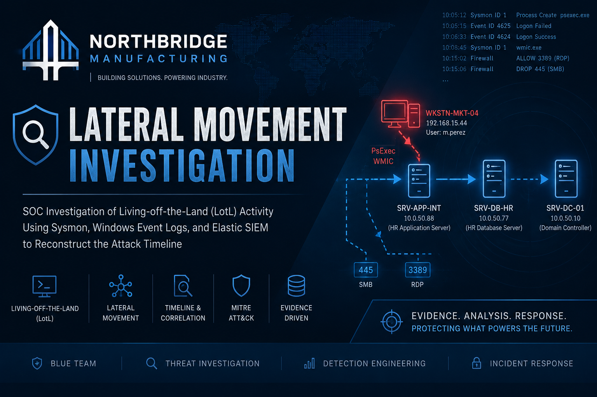
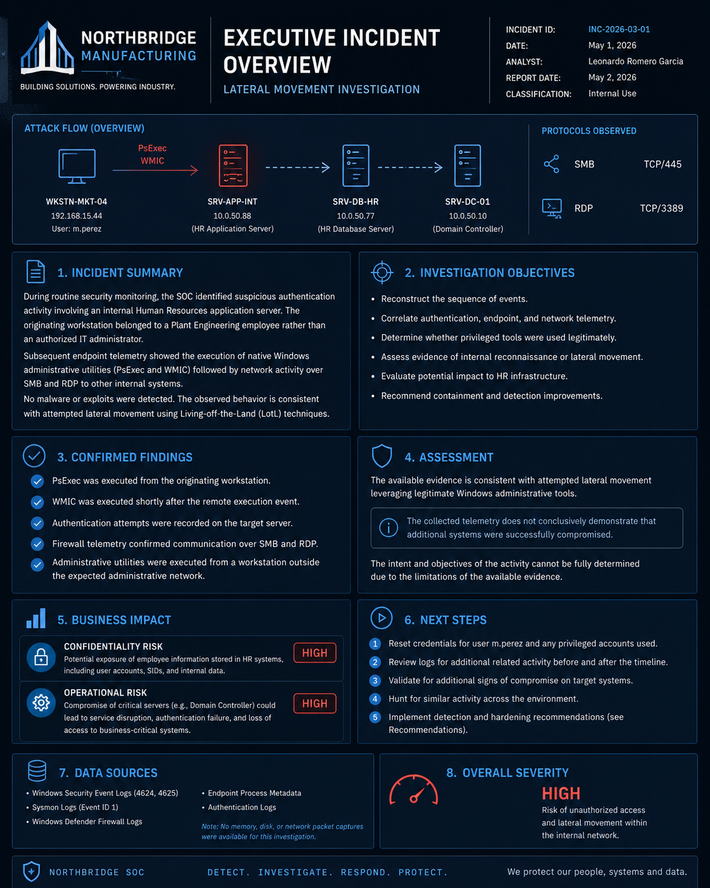

# NorthBridge Manufacturing — SOC Investigation

### Lateral Movement & Living-off-the-Land Detection | INC-2026-03-01



## Overview

This repository documents a complete SOC investigation conducted against a simulated enterprise environment based on NorthBridge Manufacturing — a multinational industrial automation company operating a hybrid Active Directory infrastructure across multiple production facilities.

The investigation was triggered by anomalous authentication activity on an internal application server, originating from a plant engineering workstation with no administrative authorization. No malware was detected. No exploit activity was observed. The investigation focused entirely on behavioral telemetry and native Windows tooling — a Living-off-the-Land (LotL) scenario.

**All conclusions are explicitly classified as CONFIRMED, INFERRED, or UNKNOWN.**  
No evidence was fabricated. No conclusions exceed what the available telemetry supports.

---

## Incident Summary

| Field | Value |
|---|---|
| **Incident ID** | INC-2026-03-01 |
| **Detection Source** | Elastic SIEM — Authentication Anomaly Alert |
| **Origin Host** | WKSTN-MKT-04 (`192.168.15.44`) |
| **User** | `m.perez` |
| **Initial Alert Severity** | Low / Informational |
| **Investigation Outcome** | Suspected lateral movement attempt — LotL techniques confirmed |
| **Containment Status** | Pending — see [Recommendations](remediation/recommendations.md) |

---

## Attack Narrative

A plant engineering user account (`m.perez`) on workstation `WKSTN-MKT-04` executed **PsExec** targeting the internal application server `SRV-APP-INT` using a separate administrative account with credentials passed in plaintext on the command line. Authentication failed on the first attempt. The same session then executed **WMIC** to enumerate local user accounts and SIDs. Within ten minutes, the host initiated outbound connections to a third host (`10.0.50.99`) on both **RDP (3389)** — permitted by the firewall — and **SMB (445)** — blocked.

No endpoint protection alert fired. No malware was involved. The attacker relied exclusively on signed, native Windows binaries.

---

## Techniques Identified

| MITRE ATT&CK ID | Technique | Tool / Observable |
|---|---|---|
| T1021.002 | Remote Services: SMB/Windows Admin Shares | `psexec.exe` → `SRV-APP-INT` |
| T1087.001 | Account Discovery: Local Account | `wmic useraccount get name,sid` |
| T1021.001 | Remote Services: Remote Desktop Protocol | Outbound port 3389 — firewall ALLOW |
| T1021 | Remote Services (lateral movement prep) | Outbound port 445 — firewall DROP |
| T1552.001 | Unsecured Credentials: Credentials in Files | Plaintext `-p` argument in PsExec command line |

---

## Repository Structure

```
northbridge-soc-investigation/
│
├── README.md                         ← You are here
│
├── investigation/
│   ├── 01-incident-overview.md       ← Scope, environment, constraints
│   ├── 02-timeline.md                ← Chronological event reconstruction
│   ├── 03-evidence-analysis.md       ← Per-event technical breakdown
│   ├── 04-attack-hypothesis.md       ← Kill chain + MITRE ATT&CK mapping
│   └── 05-risk-assessment.md         ← Business impact evaluation
│
├── iocs/
│   └── ioc-list.md                   ← Hosts, IPs, users, processes, ports
│
├── detections/
│   └── detection-opportunities.md    ← Detection gaps and rule proposals
│
└── remediation/
    └── recommendations.md            ← Controls, hardening, follow-up leads
```

---

## Environment

| Component | Detail |
|---|---|
| **Organization** | NorthBridge Manufacturing |
| **Industry** | Industrial Manufacturing (Automotive / Energy) |
| **Employees** | ~2,800 |
| **Infrastructure** | Hybrid On-Premises Active Directory + Windows Server |
| **SIEM** | Elastic SIEM |
| **SOC** | 24/7 Security Operations Center |
| **Telemetry Sources** | Windows Security Event Logs, Sysmon, Windows Defender Firewall, AD Authentication Logs |

---

## Investigation Constraints

The investigation was conducted exclusively on available log sources. The following evidence was **not available**:

- Memory acquisition
- Disk forensic images
- Network packet captures (PCAP)
- EDR live response
- PowerShell transcription logs
- Domain Controller replication data

All findings are scoped to what the available telemetry can support.

---

## Methodology

This investigation follows established frameworks:

- **NIST SP 800-61** — Incident handling lifecycle (Detection → Analysis → Containment → Recovery)
- **MITRE ATT&CK** — Technique identification and adversary behavior mapping
- **DFIR best practices** — Evidence classification, timeline reconstruction, chain-of-custody discipline

---

## About This Repository

This repository was built as a professional portfolio project demonstrating SOC analyst capabilities including:

- Behavioral threat detection without signature-based tools
- Log correlation across multiple telemetry sources
- MITRE ATT&CK technique mapping from raw evidence
- Evidence-based conclusion classification (CONFIRMED / INFERRED / UNKNOWN)
- Professional incident documentation suitable for enterprise security teams

**Author:** Leonardo Romero Garcia  
**Role Target:** SOC Analyst L1 · Blue Team · Incident Response · Junior DFIR
